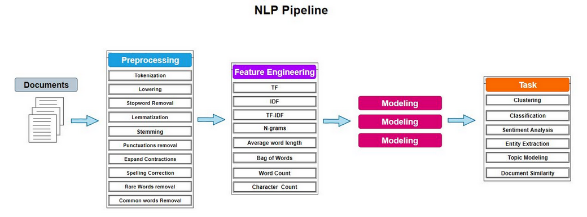

# ✈️ NLP Project: Google Play Reviews Sriwijaya Air Mobile

Proyek ini bertujuan untuk menganalisis **ulasan pengguna aplikasi Sriwijaya Air Mobile** di Google Play Store dengan pendekatan **Natural Language Processing (NLP)**.  
Hasil akhir dari pipeline ini adalah **Sentiment Analysis**, untuk memahami persepsi pengguna terhadap aplikasi.

---

## 🚀 Project Roadmap

### 1. Data Collection
- Menggunakan library `google_play_scraper` untuk mengambil ulasan aplikasi **Sriwijaya Air Mobile** dari Google Play Store.
- Data mentah disimpan sebagai CSV:  
  - `SriwijayaAir_RAW.csv`

### 2. Preprocessing
Tahapan preprocessing yang dilakukan:
- Tokenization  
- Lowercasing  
- Stopword Removal (English + Indonesian)  
- Lemmatization  
- Stemming (Sastrawi + Porter)  
- Punctuation Removal  
- Expand Contractions  
- Spelling Correction  
- Rare Words Removal  
- Common Words Removal  

Output preprocessing:
- `SriwijayaAir_Preprocessed.csv` (dataset bersih siap digunakan untuk feature engineering)

### 3. Feature Engineering
- Term Frequency (TF)  
- Inverse Document Frequency (IDF)  
- TF-IDF Vectorization  
- N-grams (bigrams & trigrams)  
- Word Count, Character Count, Average Word Length  
- Bag of Words (BoW)

### 4. Modeling
- Sentiment Classification menggunakan algoritma machine learning:  
  - Logistic Regression  
  - Naive Bayes  
  - SVM  
- Evaluasi dengan akurasi, F1-score, confusion matrix

### 5. Task (Final)
- **Sentiment Analysis**: mengklasifikasikan ulasan menjadi *positif, netral, negatif*.  
- Visualisasi hasil analisis untuk menemukan pola keluhan & kepuasan pengguna.

---

## 👨‍💻 Author
**Achmad Fahmi Ainur Ridho**  
Information Systems, Institut Teknologi Sepuluh Nopember (ITS)  
📧 Contact: [LinkedIn](https://www.linkedin.com/fahmiridho) | [GitHub](https://github.com/fahmiridho07)
