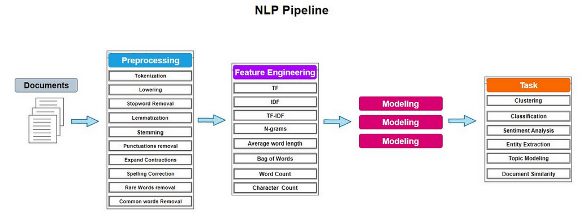
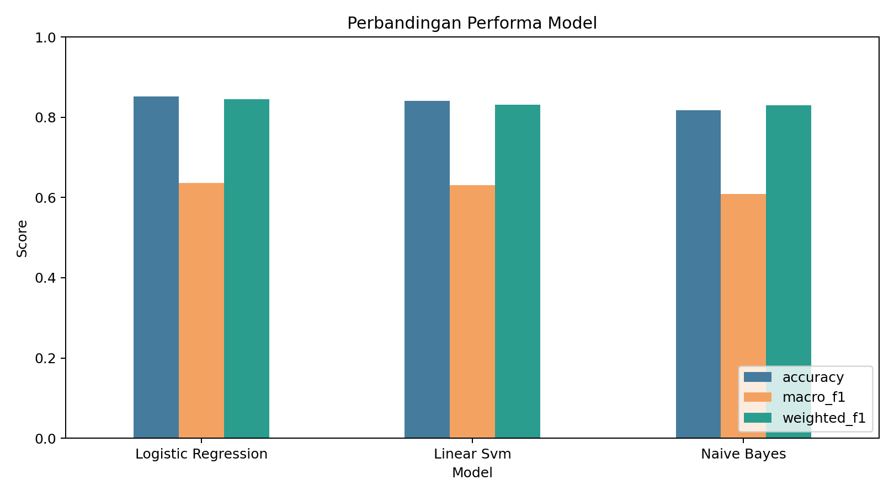
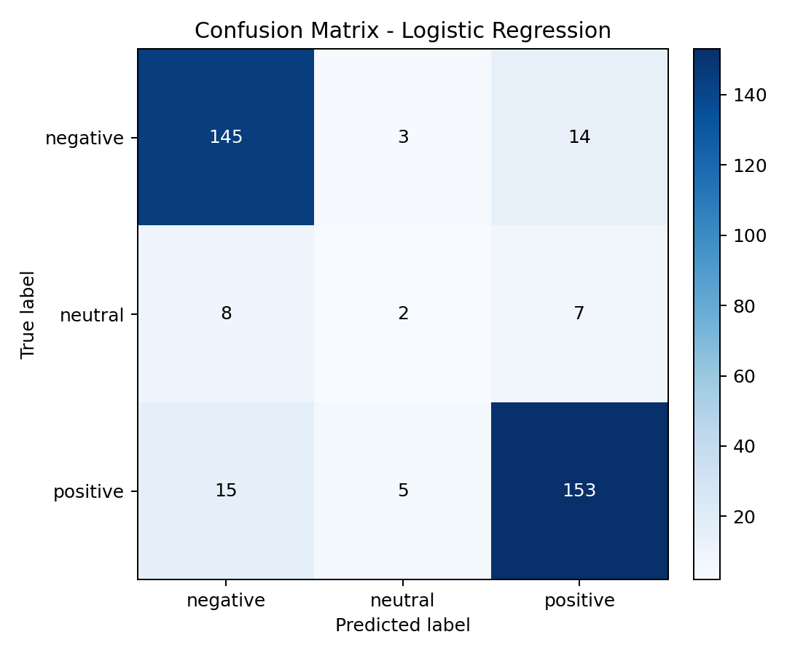
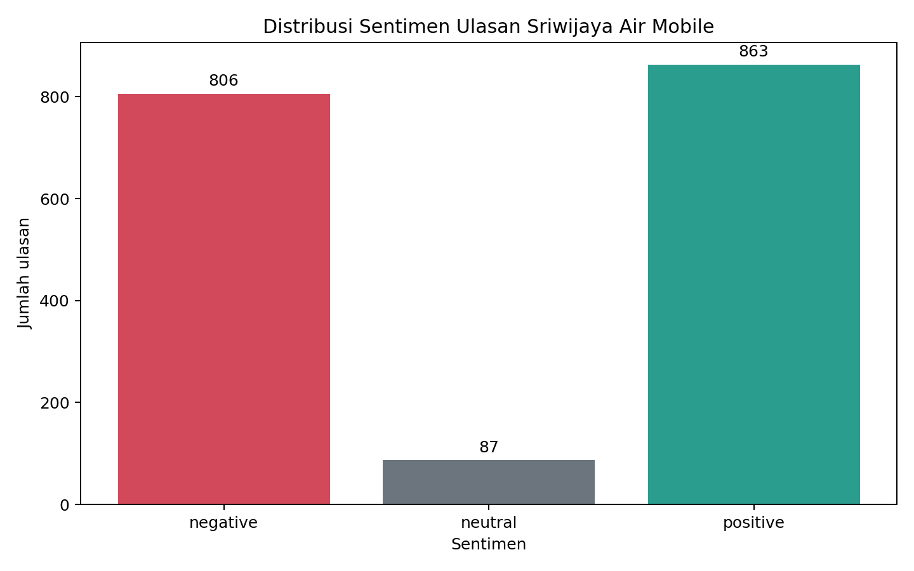
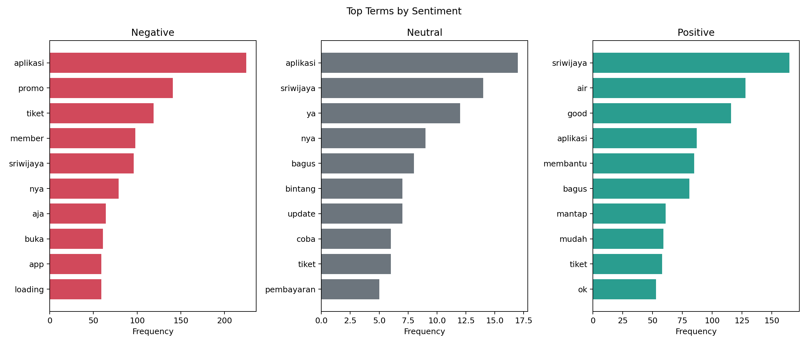

# Sentiment Analysis Sriwijaya Air Mobile App Reviews

Project Natural Language Processing (NLP) untuk menganalisis sentimen ulasan pengguna aplikasi **Sriwijaya Air Mobile** di Google Play Store. Repo ini disusun sebagai end-to-end portfolio project: mulai dari data review, preprocessing, feature engineering, modeling, evaluasi, visualisasi, hingga penyimpanan model terbaik.



## Project Objective

Tujuan utama project ini adalah mengklasifikasikan ulasan pengguna menjadi tiga kelas sentimen:

- **Negative**: rating 1-2
- **Neutral**: rating 3
- **Positive**: rating 4-5

Label sentimen diturunkan dari rating Google Play sebagai **weak label**. Artinya, label belum berasal dari anotasi manual manusia, sehingga hasil perlu dibaca sebagai pendekatan supervised learning berbasis rating.

## Dataset

Data bersumber dari review aplikasi Sriwijaya Air Mobile di Google Play Store.

| File | Deskripsi |
| --- | --- |
| `week02_dataprocessing/SriwijayaAir_RAW.csv` | Dataset mentah hasil scraping review |
| `week02_dataprocessing/SriwijayaAir_Preprocessed.csv` | Dataset hasil preprocessing dengan kolom `clean_text` |
| `outputs/processed/SriwijayaAir_Sentiment_Labeled.csv` | Dataset final dengan label sentimen dan fitur numerik |
| `outputs/processed/SriwijayaAir_Sentiment_Predictions.csv` | Dataset final dengan prediksi model terbaik |

Ringkasan data final:

- Total data awal: 1,799 review
- Data yang digunakan model: 1,756 review
- Data kosong pada `clean_text` dibuang: 43 review
- Distribusi label final: negative = 806, neutral = 87, positive = 863

## Methodology

### 1. Data Collection

Review dikumpulkan menggunakan `google_play_scraper`. Dataset raw disimpan sebagai CSV agar pipeline bisa direproduksi tanpa harus scraping ulang.

### 2. Preprocessing

Tahapan preprocessing yang sudah dilakukan:

- Lowercasing
- Tokenization
- Stopword removal bahasa Indonesia dan Inggris
- Lemmatization bahasa Inggris
- Stemming bahasa Indonesia dan Inggris
- Punctuation removal
- Contraction expansion
- Normalisasi kata
- Rare/common words handling

Output utama preprocessing adalah kolom `clean_text`.

### 3. Feature Engineering

Pipeline final menggunakan kombinasi fitur:

- TF-IDF vectorization
- Unigram, bigram, dan trigram
- Bag of Words untuk eksplorasi kata paling sering
- Word count
- Character count
- Average word length

Feature exploration disimpan di:

- `outputs/reports/top_bow_terms.csv`
- `outputs/reports/top_ngram_terms.csv`
- `outputs/reports/top_tfidf_terms.csv`
- `outputs/reports/top_terms_by_sentiment.csv`

### 4. Modeling

Model yang dibandingkan:

- Logistic Regression
- Naive Bayes
- Linear Support Vector Machine (SVM)

Konfigurasi training:

- Stratified train-test split: 80:20
- Random state: 42
- Random oversampling diterapkan hanya pada training split untuk membantu kelas minoritas `neutral`
- Evaluasi menggunakan accuracy, macro F1-score, weighted F1-score, class-level F1-score, dan confusion matrix

## Results

Model terbaik berdasarkan macro F1-score adalah **Logistic Regression**.

| Model | Accuracy | Macro F1 | Weighted F1 |
| --- | ---: | ---: | ---: |
| Logistic Regression | 0.8523 | 0.6363 | 0.8450 |
| Linear SVM | 0.8409 | 0.6306 | 0.8319 |
| Naive Bayes | 0.8182 | 0.6083 | 0.8304 |



Confusion matrix model terbaik:



Distribusi sentimen:



Top terms per sentimen:



## Portfolio Evidence Pack

Visual tambahan untuk website portfolio tersedia di `outputs/portfolio/`. Folder ini berisi gambar yang lebih cocok untuk case study recruiter:

- `01_case_study_overview.png` - ringkasan problem, dataset, model terbaik, dan metrik utama
- `02_data_label_evidence.png` - bukti mapping rating Google Play menjadi label sentimen
- `03_model_performance_evidence.png` - perbandingan model dan F1-score per kelas
- `04_confusion_matrix_evidence.png` - evaluasi prediksi pada test set
- `05_user_pain_points.png` - kata/isu yang paling sering muncul di review negatif
- `06_sentiment_trend_by_month.png` - tren sentimen berdasarkan waktu review
- `07_review_examples.png` - contoh review dan prediksi model

Panduan urutan tampilan dan copy singkat untuk website ada di `outputs/portfolio/README.md`.

## Interpretation

Model cukup kuat dalam membedakan review negative dan positive. Kelas `neutral` masih menjadi tantangan karena:

- Jumlah datanya jauh lebih kecil dibanding negative dan positive.
- Rating 3 sering berisi review yang secara teks terdengar seperti keluhan atau apresiasi ringan.
- Label berbasis rating bersifat weak label, bukan anotasi sentimen manual.

Karena itu, weighted F1 tinggi, sementara macro F1 lebih rendah. Ini wajar pada kasus multiclass sentiment analysis dengan kelas minoritas yang ambigu.

## Project Structure

```text
.
|-- README.md
|-- requirements.txt
|-- src/
|   |-- __init__.py
|   `-- sentiment_pipeline.py
|-- assets/
|   `-- pipeline.png
|-- week02_dataprocessing/
|   |-- SriwijayaAir_RAW.csv
|   `-- SriwijayaAir_Preprocessed.csv
|-- outputs/
|   |-- figures/
|   |-- processed/
|   `-- reports/
|-- models/
|   `-- best_sentiment_model.joblib
`-- Week02_SriwijayaAir_Preprocessing.ipynb
```

## How to Run

Jalankan dari root project:

```powershell
python -m venv .venv
.\\.venv\\Scripts\\activate
pip install -r requirements.txt
python src\\sentiment_pipeline.py
```

Setelah pipeline selesai, hasil akan tersimpan di:

- `outputs/processed/`
- `outputs/reports/`
- `outputs/figures/`
- `models/best_sentiment_model.joblib`

## Portfolio Highlights

Project ini menunjukkan kemampuan:

- Mengolah data review aplikasi dari Google Play Store
- Membangun preprocessing pipeline untuk teks Indonesia-Inggris
- Melakukan feature engineering NLP dengan TF-IDF dan n-gram
- Membandingkan beberapa model klasifikasi sentimen
- Mengevaluasi model dengan metrik yang sesuai untuk data imbalanced
- Membuat artefak reproducible untuk portfolio data science/NLP

## Future Improvements

Beberapa pengembangan lanjutan yang bisa dilakukan:

- Manual annotation untuk sebagian data agar label lebih valid daripada rating-based weak label
- Hyperparameter tuning dengan cross-validation
- Eksperimen model transformer multilingual seperti IndoBERT atau XLM-R
- Topic modeling khusus untuk review negative agar pola keluhan lebih detail
- Dashboard sederhana untuk memantau tren sentimen dari waktu ke waktu

## Author

**Achmad Fahmi Ainur Ridho**  
Information Systems, Institut Teknologi Sepuluh Nopember (ITS)  
LinkedIn: <https://www.linkedin.com/in/fahmiridho>  
GitHub: <https://github.com/fahmiridho07>
